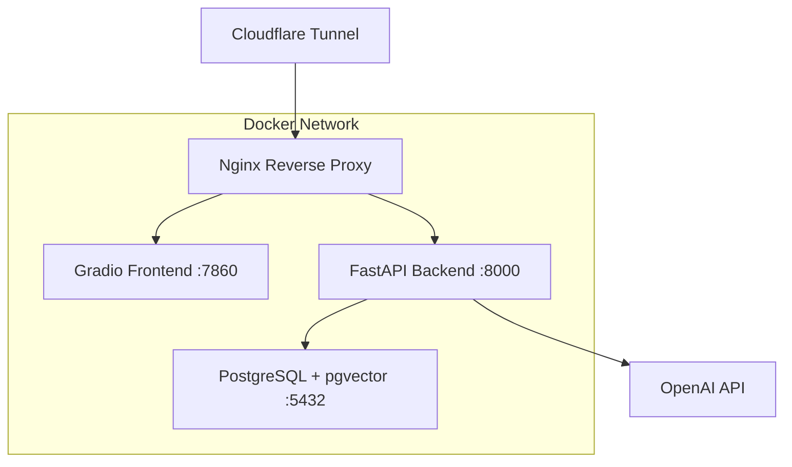

# 🏥 HIPAA QA System

A sophisticated **Retrieval-Augmented Generation (RAG)** system built with FastAPI, Gradio, and PostgreSQL that provides precise answers to HIPAA regulation questions with exact citations from 45 CFR Parts 160, 162, and 164.

[](https://www.python.org/downloads/)
[](https://fastapi.tiangolo.com/)
[](https://www.docker.com/)
[](https://www.postgresql.org/)

## 🌟 Features

- **🤖 Advanced RAG Pipeline**: OpenAI GPT-4 + text-embedding-3-large with pgvector similarity search
- **📊 Interactive Web Interface**: Beautiful Gradio frontend with real-time question processing
- **🔐 Enterprise Security**: Nginx reverse proxy with rate limiting and security headers
- **🌐 Public Access**: Cloudflare tunnel support for secure external access
- **📈 Comprehensive Monitoring**: Health checks, structured logging, and error tracking
- **🐳 Docker Orchestration**: Full containerized deployment with docker-compose
- **⚡ High Performance**: Optimized similarity search with configurable thresholds

## 🏗️ Architecture



## 🚀 Quick Start

### Prerequisites

- Docker & Docker Compose
- OpenAI API key
- 8GB+ RAM recommended

### 1. Clone Repository

```bash
git clone https://github.com/yanlaymer/hipaa_qa_rag_solution.git
cd hipaa_qa_rag_solution
```

### 2. Configure Environment

```bash
cp env.example .env
# Edit .env with your OpenAI API key
```

Required environment variables:
```env
OPENAI_API_KEY=your_openai_api_key_here
OPENAI_CHAT_MODEL=gpt-4-1
OPENAI_EMBEDDING_MODEL=text-embedding-3-large
```

### 3. Deploy with Docker

```bash
# Build and start all services
docker-compose up -d --build

# Wait for services to be healthy
docker-compose ps
```

### 4. Access the System

- **Web Interface**: http://localhost (or http://localhost:7860)
- **API Documentation**: http://localhost/api/docs
- **Health Check**: http://localhost/health

## 📋 Usage

### Web Interface

1. Open http://localhost in your browser
2. Enter your HIPAA question in the text box
3. Adjust similarity threshold (0.4 recommended for comprehensive results)
4. Click "Ask Question" to get answers with citations

### API Examples

```bash
# Ask a question via API
curl -X POST "http://localhost/api/qa/ask" \
  -H "Content-Type: application/json" \
  -d '{
    "question": "What is a business associate under HIPAA?",
    "similarity_threshold": 0.4,
    "max_chunks": 5
  }'

# Check system health
curl http://localhost/api/health/
```

### Python Client

```python
import httpx

async with httpx.AsyncClient() as client:
    response = await client.post(
        "http://localhost/api/qa/ask",
        json={
            "question": "What are the requirements for authorization under the Privacy Rule?",
            "similarity_threshold": 0.4
        }
    )
    result = response.json()
    print(result["answer"])
```

## 🛠️ Development

### Local Development Setup

```bash
# Install Python dependencies
pip install -e .

# Start database only
docker-compose up -d db

# Run backend locally
python -m src.hipaa_qa.main

# Run frontend locally
python frontend/app.py
```

### Data Ingestion

The system comes pre-loaded with HIPAA regulation data. To re-ingest:

```bash
# Ingest enhanced HIPAA chunks
docker run --rm --network hipaa-qa-system_hipaa_network \
  -v $(pwd):/app -w /app \
  hipaa-qa-system-backend \
  python scripts/ingest_enhanced_data.py
```

### Testing

```bash
# Run ground truth tests
python test_ground_truth_qa.py

# Test specific questions
python -c "
import asyncio
from test_ground_truth_qa import test_question
asyncio.run(test_question('What is a business associate under HIPAA?'))
"
```

## 📊 Configuration

### Environment Variables

| Variable | Default | Description |
|----------|---------|-------------|
| `OPENAI_API_KEY` | - | **Required** OpenAI API key |
| `OPENAI_CHAT_MODEL` | `gpt-4.1` | Chat model for answer generation |
| `OPENAI_EMBEDDING_MODEL` | `text-embedding-3-large` | Embedding model |
| `SIMILARITY_THRESHOLD` | `0.4` | Minimum similarity for chunk retrieval |
| `MAX_CHUNKS_RETRIEVED` | `5` | Maximum chunks per query |
| `LOG_LEVEL` | `INFO` | Logging level |
| `LOG_FORMAT` | `json` | Log format (`text` or `json`) |

### Performance Tuning

- **Similarity Threshold**: Lower values (0.3-0.4) for comprehensive results, higher (0.6-0.8) for precise matches
- **Max Chunks**: Increase for more context, decrease for faster responses
- **Database**: Adjust `DB_POOL_SIZE` for concurrent load

## 🔒 Security Features

- **Rate Limiting**: 30 req/s frontend, 10 req/s API
- **Security Headers**: X-Frame-Options, X-Content-Type-Options, XSS protection
- **Access Control**: Nginx-based routing and filtering
- **Data Privacy**: No persistent user data storage

## 📈 Monitoring

### Health Checks

```bash
# Nginx health
curl http://localhost/health

# Backend health
curl http://localhost/api/health/

# Database health
curl http://localhost/api/health/db
```

### Logs

```bash
# View all service logs
docker-compose logs -f

# Backend logs only
docker-compose logs -f backend

# Nginx access logs
docker-compose exec nginx tail -f /var/log/nginx/access.log
```

## 🌐 Deployment

### Production Deployment

1. **Set Production Environment**:
   ```env
   DEBUG=false
   LOG_LEVEL=WARNING
   GRADIO_SHARE=false
   ```

2. **Configure Cloudflare Tunnel** (Optional):
   ```bash
   # Tunnel automatically creates public URL
   # Check logs for URL: docker-compose logs cloudflared
   ```

3. **SSL/TLS**: Use Cloudflare tunnel or configure nginx with certificates

4. **Scaling**: Increase replica counts in docker-compose.yml

### Cloud Deployment

The system supports deployment on:
- **AWS**: ECS, EKS, or EC2 with Docker
- **Google Cloud**: Cloud Run, GKE, or Compute Engine
- **Azure**: Container Instances, AKS, or VMs
- **DigitalOcean**: App Platform or Droplets

## 🧪 Testing

### Ground Truth Evaluation

The system includes comprehensive testing with ground truth questions:

```bash
# Run all ground truth tests
python test_ground_truth_qa.py

# View test results
cat enhanced_test_results.json
```

Sample questions included:
- Business associate definitions
- Authorization requirements
- Breach notification procedures
- Administrative safeguards
- Patient access rights

## 🤝 Contributing

1. Fork the repository
2. Create a feature branch (`git checkout -b feature/amazing-feature`)
3. Commit your changes (`git commit -m 'Add amazing feature'`)
4. Push to the branch (`git push origin feature/amazing-feature`)
5. Open a Pull Request

### Development Guidelines

- Follow PEP 8 for Python code
- Add type hints for new functions
- Include tests for new features
- Update documentation as needed

## 📄 License

This project is licensed under the MIT License - see the [LICENSE](LICENSE) file for details.

## ⚠️ Disclaimer

This system is for informational purposes only and does not constitute legal advice. Always consult with qualified legal professionals for HIPAA compliance guidance.

## 🙏 Acknowledgments

- OpenAI for GPT-4.1 and embedding models
- PostgreSQL and pgvector teams
- FastAPI and Gradio communities
- HIPAA regulations (45 CFR Parts 160, 162, 164)

---
